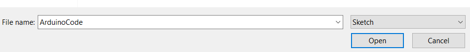
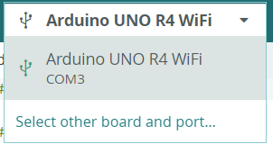
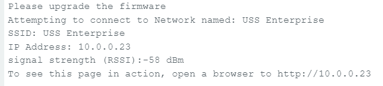
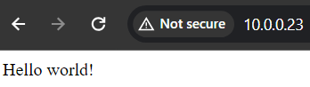

# Arduino WiFi webserver

This python code is used to generate Arduino code which can be deployed on an Arduino Uno R4 Wifi.

## Prerequisites

Run `pip3 install -r requirements.txt` in your python environment of choice.

Copy `.env.template` to `.env` and update the environment variable to match your Wifi
SSID and password.

Make HTML updates to `create_source/input_html/index.html`

## Usage

Run `python3 main.py`

Upload the directory `ArduinoCode` to the Arduino.

## Screenshots
The alt text of the screenshots provide step-by-step instructions on how to get started.

At this point, run the `python3 main.py` command within the correct directory (if you haven't already run it).

## Where to next?

If you've made it this far, congrats! Next, I recommend considering implementation of HTMX within the root HTML file. This will allow you to make changes to the source code without having to flash the Arduino everytime.

This is done by making an API call upon page load to a designated server. The results of the API call replace the HTML on the screen.

## Troubleshooting

When in doubt, press the white reset button on the Arduino board. Try to avoid doing this while in the process of writing software to the device.